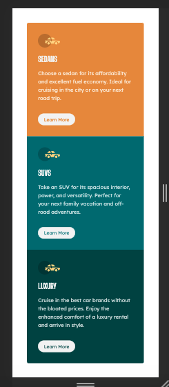

# Frontend Mentor - 3-column preview card component solution

## Table of contents

- [Overview](#overview)
 
  - [Screenshot](#screenshot)
  - [Links](#links)

  - [Built with](#built-with)
  - [What I learned](#what-i-learned)

- [Author](#author)

### Screenshot

### Links

- Solution URL: (https://www.frontendmentor.io/solutions/html-and-css-wLDNPm-6S)
- Live Site URL: [Add live site URL here](https://hungry-booth-e21068.netlify.app/)

### Built with

- Semantic HTML5 markup
- CSS custom properties

### What I learned

This was mostly review for me. One thing that I learned is the appropriate border-radius for making a button look exactly like the buttons on this page (border-radius: 30px;). That was helpful. 

## Author

- Website - [Eric Herod](https://github.com/eherod/newbie-challenge-2)
- Frontend Mentor - [@eherod](https://www.frontendmentor.io/profile/yourusername)

